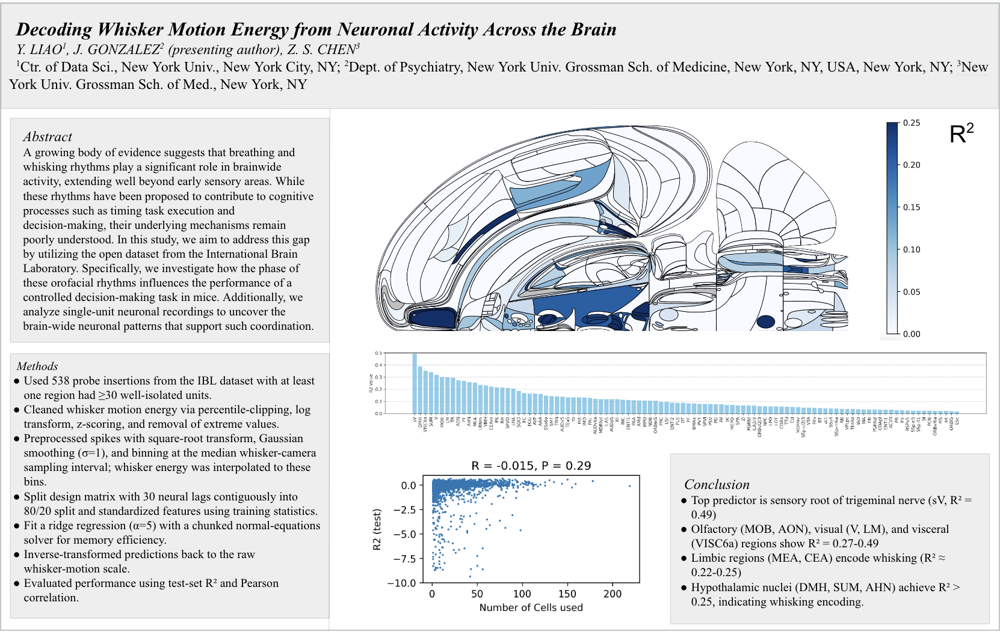

# Characterizing Breathing–Whisking Rhythms and Decoding Whisker Motion Energy
---
Analysis and Neural Decoding Using the IBL Dataset. This repository contains the code, notebooks, and figures behind two components of my 2025 Neuroscience research:

1. Do orofacial rhythm phases modulate reaction time and accuracy?
2. Decoding whisker motion energy from spike trains across the mouse brain

  

  <em>Preview of the Neuroscience 2025 poster. See full PDF in <a href="poster/poster.pdf">poster/poster.pdf</a>.</em>

All data were obtained programmatically using the
International Brain Laboratory [(IBL) ONE API](https://int-brain-lab.github.io/ONE/). 

The repo is intentionally notebook-first and self-contained: every computation, figure, and statistical test is reproducible directly from the notebooks. Due to large size of neural spike matrix, we recommend having at least 30GB RAM. Google colab's high RAM runtimes are sufficient. 

# Overview
The project has two major components:

1. Phase Modeling: Reaction Time and Accuracy
I investigated whether breathing and whisking phase influence behavioral performance on a decision-making task.

Key steps:

- Computed whisker phase using motion energy, with nose PCA (PC1) as a secondary proxy.
- Built amplitude-aware phase models using sine/cosine encodings to avoid circularity issues.
- Fit both:
    - Ordinary Least Squares (OLS) models on raw reaction time.
    - Robust linear models using Tukey’s biweight on log-reaction-time.
- Assessed rhythmic components via joint Wald χ² tests on sine/cosine terms.
- Reported peak-to-trough modulation depth derived from fitted phase coefficients.

The final models quantify how strongly orofacial rhythms structure behavioral latency.

2. Brain-Wide Neural Decoding of Whisker Motion Energy

Goal: decode whisker motion energy from multi-probe neural recordings across the mouse brain.

Methods:
- Constructed lagged linear regression models (240k+ timepoints).
- Performed regularized ridge regression with multiple normalization schemes.
- Summarized decoding performance into a brain-wide R² atlas aggregated by region.

Key findings (replicated across sessions):
- Highest predictive region: sensory trigeminal root (sV), R² ≈ 0.49
- Olfactory / early visual (MOB, AON, V, LM) and visceral cortex (VISC6a): R² 0.27–0.49
- Limbic areas (MEA, CEA): R² ≈ 0.22–0.25
- Hypothalamic nuclei (DMH, SUM, AHN): R² > 0.25

These results strengthen the view that whisking is a distributed sensorimotor activity with correlates far beyond primary somatosensory structures.
